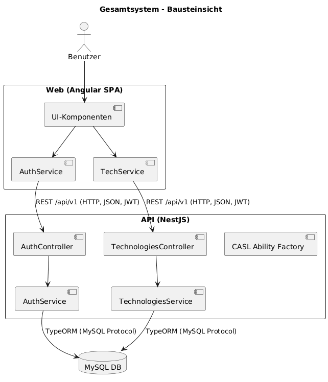
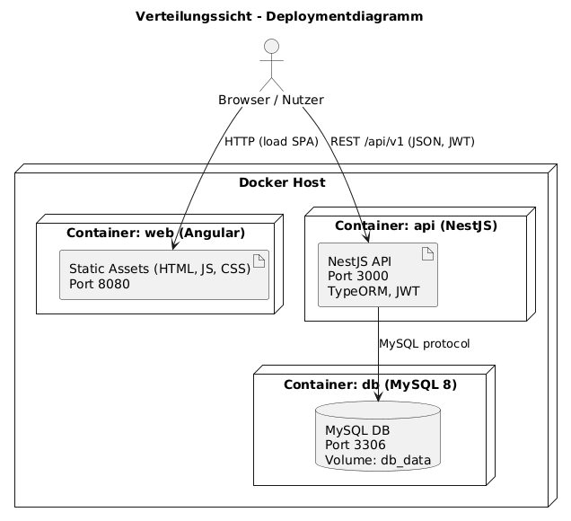

#    

**Über arc42**

arc42, das Template zur Dokumentation von Software- und
Systemarchitekturen.

Template Version 8.2 DE. (basiert auf AsciiDoc Version), Januar 2023

Created, maintained and © by Dr. Peter Hruschka, Dr. Gernot Starke and
contributors. Siehe <https://arc42.org>.

# 1. Einführung und Ziele

## 1.1 Aufgabenstellung

Im Rahmen des Moduls *Web Programming Lab* wird ein individuelles Softwareprojekt umgesetzt.  
Geplant ist die Realisierung eines **Technologie-Radars** als Webanwendung.

Der Radar dient dazu, Technologien zu erfassen, in Kategorien und Reifegrade einzuordnen und für Nutzer sichtbar zu
machen.  
Es sollen zentrale Basisfunktionalitäten wie Verwaltung (Administration) und Anzeige (Viewer) realisiert werden.

## 1.2 Ziele

- Entwicklung einer lauffähigen Webanwendung (Radar-Administration und Radar-Viewer)
- Einfache, nachvollziehbare Architektur
- Dokumentation nach arc42 (Fokus auf Kapitel 4-10)
- Reflexion über Vorgehen und Lernerfahrungen

## 1.3 Nicht-Ziele

- Keine vollständige, produktionsreife Plattform
- Keine komplexe Infrastruktur (Cloud, Kubernetes etc.)
- Keine vollständige Abbildung aller möglichen Features eines Technologie-Radars

## 1.4 Stakeholder

- **Dozent (Betreuung)** - erwartet klare Ergebnisse, Dokumentation
- **Student (Umsetzung)** - verantwortlich für Planung, Implementierung und Reflexion
- **Endnutzer:innen (fiktiv)** - sollen den Radar intuitiv nutzen können

---

# 2. Randbedingungen

## 2.1 Fachliche Randbedingungen

- Projekt wird in **Einzelarbeit** durchgeführt
- Zeitbudget: ca. **60 Stunden** inkl. Implementierung, Dokumentation
- Umsetzung eines **Technologie-Radars**

## 2.2 Organisatorische Randbedingungen

- Betreuung durch Dozent im Modul *Web Programming Lab*
- Abgabe: Architekturdokumentation, Reflexion, Arbeitsjournal, Softwareartefakte

## 2.3 Technische Randbedingungen

- **Frontend:** Angular
- **Backend:** NestJS
- **Persistenz:** Datenbank noch offen
- **Entwicklung:** lokal, ggf. Container-basiert

## 2.4 Qualitäts- und Prozessrandbedingungen

- Strukturierte Dokumentation (arc42)
- Versionskontrolle via Git
- Lokale Builds & Tests
- Ergebnis muss reproduzierbar lauffähig sein


# 3. Kontextabgrenzung 
## 3.1 Fachlicher Kontext

**Ziel des Systems:** Ein _Technologie‑Radar_ verwalten, in dem Technologien (Name, Beschreibung, Kategorie, Ring, Veröffentlichungsstatus) erfasst, veröffentlicht und angezeigt werden.

**Akteure & Ziele**

| Akteur | Beschreibung | Hauptziele |
|---|---|---|
| **Besucher** (unauthentifiziert) | Personen ohne Login | Veröffentlichten Technologie‑Radar ansehen. |
| **Benutzer** (`Role.user`) | Registrierte, eingeloggte Nutzer | Technologien lesen. |
| **Administrator** (`Role.admin`) | Verantwortliche mit erweiterten Rechten | Technologien anlegen, als Entwurf speichern, bearbeiten, veröffentlichen, löschen |

**Fachliche Objekte**

- **Technology**: `id (uuid)`, `name`, `description?`, `category` (z. B. `techniques`, `platforms`, …), `ring?` (z. B. `adopt`, `trial`, …), `published (bool)`, `createdAt`, `updatedAt`, `publishedAt?` (Quelle: TypeORM‐Entity).
- **User**: `id (uuid)`, `username`, `password (gehasht)`, `roles: Role[]` (`user|admin`).

## 3.2 Technischer Kontext

**Laufzeit‑Umgebung (lokal via Docker Compose):**

- **Web (Angular)** unter `http://localhost:8080`, kommuniziert per HTTP/JSON mit der API. (siehe `apps/web/Dockerfile`, `apps/docker-compose.yml`)  
- **API (NestJS)** unter `http://localhost:3000/api/v1` mit globalem Prefix `api` und URI‑Versionierung `v1` (siehe `apps/api/src/main.ts`).  
- **Datenbank (MySQL 8)** erreichbar auf Port `3306`; Zugriff aus der API via **TypeORM** (siehe `apps/api/src/app.module.ts`).  
- **CORS** ist in der API offen konfiguriert (origin `*`). **ValidationPipe** mit Whitelisting, Transformation und Versionierung aktiv.

**Authentifizierung & Autorisierung**

- **JWT**‑basierte Authentifizierung: `/auth/login` gibt ein Access‑Token zurück (HMAC‑Signatur mit `JWT_SECRET`), Guard extrahiert `Authorization: Bearer <token>` (siehe `auth.guard.ts`).  
- **Rollen & Policies**: Rollen `admin`, `user`; Autorisierung per **CASL** Ability Factory (z. B. `admin => can manage all`, `user => can read all`).

**Kommunikationsbeziehungen (vereinfacht)**

```
[Browser/Angular SPA]
        |
        | HTTP/JSON (REST), Bearer JWT
        v
[NestJS API (v1, /api)]
        |
        | TypeORM (MySQL protocol)
        v
      [MySQL DB]
```

## 3.3 Externe Schnittstellen (API)

**Basis‑URL:** `http://<host>:3000/api/v1`  &nbsp;(**Frontend‑Konfiguration:** `API_BASE_URL` via `window.__env` oder `environment.apiUrl`).

### Auth

| Methode | Pfad | Request | Response | Hinweise |
|---|---|---|---|---|
| `POST` | `/auth/login` | `{ username, password }` | `200 OK` mit JWT im Body/Headers | `@Public` Endpunkt. |
| `POST` | `/auth/register` | `{ username, password }` | `201 Created` | `@Public` Endpunkt; legt Nutzer an. |

### Technologies

_Basis_: `/technologies` (Controller‐Prefix). DTOs: `CreateTechnologyDto`, `CreateTechnologyDraftDto`, `UpdateTechnologyDto`, `ReadTechnologyDto`.

| Methode | Pfad | Request | Response | Berechtigung |
|---|---|---|---|---|
| `GET` | `/technologies` | - | `ReadTechnologyDto[]` | `read` |
| `GET` | `/technologies/{id}` | - | `ReadTechnologyDto` | `read` |
| `POST` | `/technologies` | `CreateTechnologyDto` | - | `create` |
| `POST` | `/technologies/draft` | `CreateTechnologyDraftDto` | - | `create` |
| `PUT` | `/technologies` | `UpdateTechnologyDto` | - | `update` |
| `PATCH` | `/technologies/{id}/publish` | - | - | `update` |
| `DELETE` | `/technologies/{id}` | - | - | `delete` |

**Fehlerbehandlung (Auszug):**
- `404 Not Found` bei unbekannter `Technology` (z. B. Delete/Update)  
- `400 Bad Request` durch ValidationPipe bei ungültigen DTOs  
- `401 Unauthorized` ohne/mit ungültigem JWT (Guard)  
- `403 Forbidden` bei fehlender Policy (CASL Guard)

## 3.4 Abgrenzung / Nicht‑Ziele

- Keine E‑Mail‑/Social‑Login‑Integration; Registrierung lokal.  
- Kein Versionieren einzelner Technology‑Einträge.  
- Keine Mehrmandantenfähigkeit oder RBAC jenseits `user/admin` vorgesehen.
- Keine Useradministration

# 4. Lösungsstrategie

Die Architektur verfolgt das Ziel, eine **einfache, verständliche und lauffähige Webanwendung** zu realisieren.

- **Frontend:** Angular Single-Page-Application zur Darstellung und Interaktion mit dem Technologie-Radar. Kommuniziert ausschliesslich per REST/HTTP mit der API.  
- **Backend:** NestJS (Node.js) als strukturierter Framework-Ansatz mit klarer Modularisierung (Auth, Technologies, CASL für Berechtigungen).  
- **Persistenz:** MySQL-Datenbank über TypeORM-ORM. Automatisches Schema-Sync für Entwicklungszwecke.  
- **Sicherheit:** JWT-basierte Authentifizierung, rollenbasierte Autorisierung (Admin/User) via CASL.  
- **Bereitstellung:** Lokale Entwicklung und Betrieb per Docker Compose (Services: db, api, web).  
- **Qualität:** Validierung mit NestJS ValidationPipe, Testbarkeit über Unit- und E2E-Tests, einfache CI-Integration möglich.

# 5. Bausteinsicht

Die Anwendung besteht aus drei zentralen Bausteinen, die klar getrennt sind:

## Whitebox Gesamtsystem



### Enthaltene Bausteine

- **Web (Angular)**
  - Darstellung des Technologie-Radars
  - Authentifizierung & Sitzungsverwaltung (JWT im LocalStorage)
  - CRUD-Operationen für Technologien über REST-API
- **API (NestJS)**
  - Module:
    - **Auth**: Registrierung, Login, JWT-Generierung, Guards
    - **Technologies**: CRUD-Logik für Technology-Entitäten
    - **CASL**: Autorisierungsregeln für Rollen (Admin/User)
  - ValidationPipe, Versionierung und REST-Schnittstellen
- **Datenbank (MySQL)**
  - Persistenzschicht über TypeORM
  - Entities: `User`, `Technology`

### Wichtige Schnittstellen

- **Frontend → API**: HTTP/JSON (REST, Version `v1`, Prefix `/api`)
- **API → DB**: MySQL-Protokoll via TypeORM
- **Auth-Flow**: JWT Bearer Token im `Authorization`-Header

---


# 6. Laufzeitsicht

Die Laufzeitsicht beschreibt das Zusammenspiel der Bausteine während typischer Nutzungsszenarien.

## 6.1 Szenario: Benutzer-Login

1. Benutzer gibt im Angular-Frontend Benutzername & Passwort ein.  
2. `AuthService` im Frontend ruft `POST /api/v1/auth/login` auf.  
3. Das Backend (`AuthController` → `AuthService`) prüft die Anmeldedaten gegen die Datenbank (User-Entity, Passwort-Hash).  
4. Bei Erfolg erzeugt das Backend ein **JWT** mit Rolleninformationen und gibt es zurück.  
5. Das Frontend speichert das Token im LocalStorage und nutzt es für weitere Requests (`Authorization: Bearer <token>`).

---

## 6.2 Szenario: Technologie anlegen

1. Benutzer mit Rolle **Admin** öffnet das Formular im Frontend.  
2. `TechService` sendet `POST /api/v1/technologies` mit dem DTO im Request-Body.  
3. Im Backend prüft der `PoliciesGuard` mit Hilfe der CASL-Ability, ob der Benutzer die Aktion `create` auf `Technology` ausführen darf.  
4. Bei Erfolg wird die Entity erzeugt und über TypeORM in MySQL gespeichert.  
5. Das Backend gibt den entsprechenden Statuscode zurück 
6. Der User wird auf die vorherige Seite weitergeleitet.

---

## 6.3 Szenario: Radar anzeigen (öffentlicher Zugriff)

1. Nicht eingeloggter Benutzer ruft `GET /api/v1/technologies` auf.  
2. Da der Endpunkt als `@Public()` markiert ist, greift kein AuthGuard.  
3. `TechnologiesService` liest alle veröffentlichten Einträge aus der Datenbank.  
4. Backend liefert eine Liste von `ReadTechnologyDto` zurück.  
5. Das Angular-Frontend rendert den Radar mit den Quadranten, Ringen und Technologien.

---
# 7. Verteilungssicht

Die Verteilungssicht beschreibt die physische Ausführungsumgebung und wie die Bausteine auf Infrastrukturkomponenten verteilt sind.

## 7.1 Infrastrukturübersicht

Die Lösung wird lokal mit **Docker Compose** betrieben und besteht aus drei Containern:

- **Web (Angular SPA)**
  - Build mit Node/Angular CLI, Auslieferung über Container auf Port `8080`
  - Zugriff auf API über `API_BASE_URL=http://localhost:3000/api/v1`

- **API (NestJS)**
  - Node.js-App, läuft auf Port `3000`
  - Bietet REST-API mit Prefix `/api/v1`
  - Verwendet TypeORM für Datenbankzugriff
  - Nutzt JWT für Authentifizierung

- **DB (MySQL 8)**
  - Persistente Speicherung der Entities `User` und `Technology`
  - Exponiert Port `3306`
  - Datenhaltung in Volume `db_data`




## 7.2 Zuordnung der Bausteine

- Angular-Frontend → Container **web**
- NestJS-Backend → Container **api**
- TypeORM-Entities (User, Technology) → Container **db**

---

## 7.3 Kommunikationspfade

- **Browser ↔ Web**: HTTP (Angular SPA wird geladen)  
- **Browser ↔ API**: REST/HTTP (JSON), Authentifizierung per JWT  
- **API ↔ DB**: MySQL-Protokoll über TypeORM  

---

## 7.4 Deployment-Varianten

- **Lokal**: via `docker-compose up`, alle Container auf einem Rechner  


# 8. Querschnittliche Konzepte

Dieses Kapitel beschreibt allgemeine Entwurfs- und Implementierungsprinzipien, die das gesamte System betreffen.

## 8.1 Authentifizierung & Autorisierung
- **JWT**-basierte Authentifizierung (Access Token im `Authorization: Bearer <token>` Header).
- **Rollenmodell**: `user` (nur lesender Zugriff) und `admin` (CRUD).
- **CASL**-Framework zur Definition feingranularer Policies (z. B. `can(Action.Manage, 'all')`).

## 8.2 Fehler- und Ausnahmebehandlung
- Globale **ValidationPipe** in NestJS: ungültige DTOs führen zu `400 Bad Request`.
- Einheitliche Statuscodes: `401 Unauthorized`, `403 Forbidden`, `404 Not Found`.
- Exception-Filter von NestJS können erweitert werden.

## 8.3 Datenvalidierung
- DTOs mit `class-validator` und `class-transformer`.
- Serverseitig verpflichtend, clientseitig ergänzend (Form-Validierung in Angular).

## 8.4 Persistenz
- **TypeORM** als ORM mit automatischem Schema-Sync (Entwicklung).
- Entities: `User`, `Technology`.
- Speicherung in **MySQL 8**, Container-Volume für Persistenz (`db_data`).

## 8.5 Konfiguration
- Nutzung von **NestJS ConfigModule**, Werte über `.env` und Docker Compose gesetzt:
  - `JWT_SECRET`, `DB_HOST`, `DB_PORT`, `DB_USER`, `DB_PASSWORD`, `DB_NAME`.

## 8.6 Logging & Monitoring
- Aktuell: Standard-Logger von NestJS.
- Optionale Erweiterung für persistentes Logging oder Metriken (z. B. Winston, Prometheus).

## 8.7 Frontend-Kommunikation
- Angular **HttpClient** kapselt API-Aufrufe.
- `AuthService` und `TechService` übernehmen den Zugriff.
- `API_BASE_URL` konfigurierbar über `window.__env` oder `environment.ts`.

## 8.8 Sicherheit
- Passwörter werden mit **bcrypt** gehasht gespeichert.
- JWT-Secret aktuell in env gespeichert, sollte noch geprüft werden

---

# 9. Architekturentscheidungen

## 9.1 Programmiersprachen und Frameworks
- **Entscheidung:** Frontend mit **Angular**, Backend mit **NestJS**.
- **Begründung:** 
  - Angular bietet ein klar strukturiertes Framework für SPAs mit guter Tool-Unterstützung.
  - NestJS integriert Best Practices (Dependency Injection, Module, Guards) und erleichtert den Einstieg.

## 9.2 Persistenz
- **Entscheidung:** **MySQL** als relationale Datenbank, Zugriff via **TypeORM**.
- **Begründung:** 
  - Relationale Struktur für Users/Technologies ausreichend.
  - TypeORM vereinfacht Mapping von Entities und Migrationen.
  - MySQL ist weit verbreitet und einfach nutzbar.

## 9.3 Authentifizierung & Autorisierung
- **Entscheidung:** **JWT**-basierte Authentifizierung mit rollenbasierter Autorisierung (CASL).
- **Begründung:** 
  - Standardisiert, einfach für SPAs nutzbar.
  - CASL erlaubt feingranulare Policies.

## 9.4 Deployment
- **Entscheidung:** **Docker Compose** für lokale Entwicklungsumgebung.
- **Begründung:** 
  - Einfache Reproduzierbarkeit, Trennung der Services (web/api/db).
  - Erfordert keine komplexe Infrastruktur.
# 10. Risiken und Technische Schulden

## 10.1 Risiken

- **Umgang mit Secrets**  
  Aktuell werden sensible Daten wie `JWT_SECRET` oder Datenbank-Passwörter in `docker-compose.yml` bzw. Umgebungsvariablen im Klartext verwaltet.  
  → Risiko von Sicherheitslecks bei versehentlichem Push in ein öffentliches Repo oder unsicherer Speicherung.  

- **Benutzerverwaltung**  
  Es existieren nur einfache Rollen (`user`, `admin`). Es fehlt ein vollständiges User-Management (z. B. Passwort-Zurücksetzen, E-Mail-Bestätigung, Profilverwaltung).  
  → Risiko: eingeschränkte Nutzbarkeit, unsichere Passwortverwaltung.  

- **CORS-Konfiguration**  
  Das Backend erlaubt aktuell CORS-Anfragen von allen Ursprüngen (`origin: '*'`).  
  → Risiko: Potenziell unsichere Nutzung im produktiven Umfeld, da jede Domain Requests stellen darf.  

## 10.2 Technische Schulden

- **Frontend-Formularvalidierung**  
  Aktuell unschöne Validierung zwischen Draft und direktem Publishing
  → Technische Schuld: Schlechte Nutzererfahrung, Validierung in mehreren Komponenten

- **Fehlendes Logging & Monitoring**  
  Es wird kaum geloggt und gemonitored.  
  → Technische Schuld: Keine strukturierte Analyse bei Fehlern oder im Betrieb möglich.

- **Fehlende Testabdeckung im Frontend**  
  Während Backend-Tests (Jest) vorbereitet sind, fehlen umfassende Tests im Angular-Frontend.  
  → Technische Schuld: Fehleranfälligkeit bei UI-Änderungen.

- **Einfache Passwortsicherheit**  
  Zwar werden Passwörter mit bcrypt gehasht, aber es fehlen Sicherheitsmechanismen wie Passwort-Policies, Rate Limiting oder Account Locking.  
  → Technische Schuld: Schwachstellen im Security-Konzept.

---
